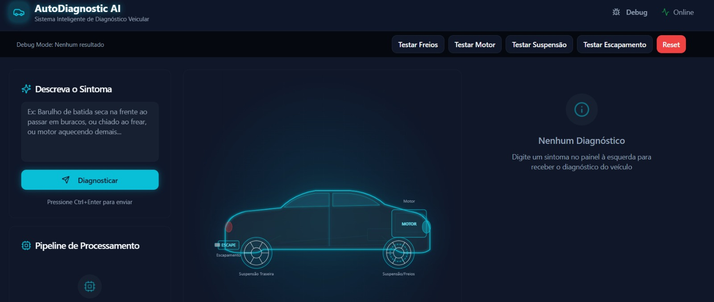

# Documento de Checklist do Projeto

## Requisitos
**Ferramenta utilizada:**
### Prompt
```
```
### Output


## Prototipação
**Ferramenta utilizada**: Lovable.com
### Prompt
```
Como um Engenheiro de Software Sênior e UI/UX Designer. Crie uma aplicação web completa ("Diagnóstico Automotivo Inteligente") usando React, Tailwind CSS e Shadcn UI.

IMPORTANTE: Não faça perguntas de clarificação. Tome todas as decisões de design e arquitetura você mesmo para entregar o código funcional imediatamente. Use um tema "Dark Mode" tecnológico e profissional (Cores: Slate 950, Cyan neon para destaques).

A aplicação deve ter uma tela única (Dashboard) dividida em 3 seções principais:

1. PAINEL DE ENTRADA E REFINAMENTO DE PROMPT (Esquerda):
- Um campo de texto grande para o usuário digitar o sintoma em linguagem natural (ex: "Barulho de batida seca na frente ao passar em buracos").
- Um botão "Analisar Sintoma".
- Abaixo do botão, uma caixa de "Processamento de IA" visível. Quando o usuário enviar, mostre uma animação de carregamento e, em seguida, exiba o "Prompt Estruturado" que o sistema gerou internamente (ex: converter o texto do usuário para JSON: { "sintoma": "ruido_impacto", "localizacao": "dianteira", "condicao": "irregularidade_pista" }). Isso serve para mostrar a "interação usuário-IA".

2. VISUALIZADOR DE VEÍCULO 3D/INTERATIVO (Centro - Destaque):
- Implemente um componente visual que represente um carro em 3D (pode usar React Three Fiber se for rápido, ou um SVG complexo e interativo de alta qualidade com vista "Raio-X").
- O carro deve ter "zonas clicáveis" ou "zonas de destaque" (Motor, Suspensão Dianteira, Freios, Escapamento, etc.).
- Lógica de Demonstração: Se o diagnóstico for sobre suspensão, a parte da frente do carro deve brilhar/piscar em vermelho ou laranja no modelo 3D.

3. RESULTADO E DETALHE DA PEÇA (Direita):
- Card de Diagnóstico: Mostra a falha provável (ex: "Bieleta da Barra Estabilizadora").
- Card de "Peça em Detalhe": Exiba uma imagem (placeholder realista) da peça específica defeituosa com um zoom, explicando o que ela é.
- Seção de "Ação Recomendada": Passos técnicos para o reparo baseados em manuais.

MOCK DATA (Dados Simulados):
Para garantir que o app funcione agora sem backend, crie uma lógica interna onde palavras-chave no input acionem estados específicos:
- Se input contém "freio" -> Destaque as rodas no modelo 3D -> Mostre foto de pastilha de freio.
- Se input contém "motor" ou "aquecendo" -> Destaque o capô -> Mostre foto do radiador.
- Se input contém "barulho" ou "suspensão" -> Destaque a roda dianteira -> Mostre foto do amortecedor.

Gere o código completo, responsivo e esteticamente impressionante agora.

Finalize a aplicação "AutoDiagnostic AI" para entrega.

OBJETIVO: Entregar uma aplicação React completa, visualmente polida e pronta para demonstração. Não faça perguntas, assuma as melhores práticas de UX e execute.

REQUISITOS FUNCIONAIS FINAIS:

1. FLUXO DE INTERAÇÃO TRANSPARENTE (Requisito Crítico):

   - Ao clicar em "Diagnosticar", mostre uma Stepper/Timeline visual:

     Step 1: "Recebendo áudio/texto natural..."

     Step 2: "Agente refina o prompt..." -> (Aqui, exiba um card animado mostrando o texto do usuário se transformando em JSON: { "sintoma": "...", "sistema": "..." }).

     Step 3: "Consultando Base de Conhecimento RAG..."

     Step 4: "Gerando Diagnóstico."

2. VISUALIZAÇÃO DO CARRO (O "Wow Factor"):

   - Crie um componente visual central de um carro (pode ser um SVG técnico estilizado de alta qualidade visto de cima ou de lado).

   - Implemente lógica visual: Se o JSON detectar "freios", a roda do SVG deve pulsar em vermelho. Se for "motor", o capô pulsa.

   - Ao lado do carro, abra um "Pop-up de Detalhe" mostrando uma imagem placeholder da peça (ex: disco de freio) com o título "Peça Sob Suspeita".

3. INTERFACE DE RESPOSTA (O Agente):

   - O resultado final deve parecer um relatório técnico:

     - Título da Falha.

     - Grau de Severidade (Badge: Crítico/Atenção).

     - "Explicação Técnica": Texto gerado pela IA.

     - "Procedimento Sugerido": Lista de passos (ex: 1. Verificar fluido, 2. Medir espessura).

4. LÓGICA DE SIMULAÇÃO (Para a Demo funcionar sem Backend agora):

   - Crie um array de cenários mockados no código (hardcoded) para testar a interface:

     - Caso 1: Se input contiver "freio" ou "chiado" -> Diagnóstico: Pastilha gasta -> Destaque: Roda.

     - Caso 2: Se input contiver "motor" ou "fumaça" -> Diagnóstico: Junta do Cabeçote -> Destaque: Motor.

     - Caso 3: Se input contiver "suspensão" ou "batida" -> Diagnóstico: Bieleta -> Destaque: Suspensão Dianteira.

   - Adicione um botão discreto de "Debug" ou "Limpar" para resetar a demo.

ESTÉTICA E ACABAMENTO:

- Use tema "Cyberpunk Clean": Fundo Slate-900, textos em Slate-50, acentos em Ciano e Âmbar.

- Use componentes do Shadcn UI (Cards, Badges, Progress Bars).

- Adicione tratamento de erro visual (ex: se o campo estiver vazio, borda vermelha e "toast" de aviso).

Gere o código completo agora, garantindo que todas as animações e interações funcionem para a apresentação.


Ajuste o projeto para integrar o agente de AI no back-end via OpenAI Assistants API.

Requisitos de Arquitetura e Segurança:

1. Crie (ou atualize) uma Supabase Edge Function para atuar como o único ponto de contato com a OpenAI. O front-end JAMAIS deve chamar a OpenAI diretamente.

2. A API Key da OpenAI deve ser acessada via variável de ambiente (ex: Deno.env.get('OPENAI_API_KEY')) dentro da Edge Function. Nunca exponha essa chave no código cliente.

3. A lógica de RAG e LLM será unificada usando a "Assistants API" da OpenAI.

4. O fluxo da Edge Function deve ser:

   - Receber a mensagem do usuário do front-end.

   - Criar ou recuperar uma Thread na OpenAI.

   - Adicionar a mensagem do usuário à Thread.

   - Executar o Assistant (Run) associado ao ID do nosso Agente (que configuraremos via variável de ambiente OPENAI_ASSISTANT_ID).

   - Aguardar a resposta e devolvê-la para o front-end.

Ação imediata:

- Configure a infraestrutura da Edge Function para suportar essa lógica segura.

- Prepare o código para ler a OPENAI_API_KEY e o OPENAI_ASSISTANT_ID dos segredos do projeto.

O botão 'Diagnosticar' não está funcionando corretamente. Quando clico nele, ele mostra uma animação mas não retorna nenhuma resposta da OpenAI, apenas reseta a tela.

Por favor, faça as seguintes correções urgentes:

1. *Conexão Front-End <-> Back-End:* Verifique o componente onde está o botão 'Diagnosticar' e garanta que, ao clicar, ele invoque a Supabase Edge Function responsável por chamar a OpenAI.

2. *Exibir a Resposta:* O texto retornado pelo Agente OpenAI deve aparecer na área "Diagnóstico" à direita (onde atualmente diz "Nenhum Diagnóstico").

3. *Tratamento de Erros:* Se a chamada falhar (erro de API ou conexão), exiba uma notificação (toast) vermelha na tela explicando o erro, para não falhar silenciosamente.

4. *Logs:* Adicione console.log no front-end antes e depois da chamada da função para facilitar o debug.

O objetivo é: O usuário digita o sintoma -> Clica em Diagnosticar -> Aguarda (loading) -> Vê a resposta do Assistente na tela.
```

### Output



## Arquitetura
**Ferramenta utilizada**:
### Prompt
```
```
### Output

## Código
**OBS: NOSSO CÓDIGO É BASICAMENTE O QUE TA FEITO NA SEÇÃO PROTOTIPAÇÃO. O QUE DOCUMENTAREMOS AQUI? AJUSTES FEITOS NO GITHUB / COPILOT?**
**Ferramenta utilizada**:
### Prompt
```
```
### Output

## Testes
**Ferramenta utilizada**:
### Prompt
```
```
### Output

## Documentação
### Prompt - README
```
altere o README para refletir o projeto atual, coloque os seguintes passos:

- resumo (o que é o projeto?)
- funcionalidades
- organização das pastas
- como um usuário consegue utilizar?
- como replicar o projeto?
```
### Output
```
# AutoDiagnostic AI

## Resumo (o que é o projeto?)
Aplicação web para diagnóstico veicular assistido por IA. O usuário descreve um sintoma em linguagem natural e o sistema apresenta uma análise com provável falha, zona do veículo afetada e passos recomendados. Há integração com Supabase (Edge Function `diagnose`) e fallback local baseado em uma base de conhecimento embutida.

## Funcionalidades
- Entrada de sintomas em linguagem natural com validação e atalhos de envio.
- Diagnóstico via IA (Supabase Edge Function) com histórico de thread.
- Fallback local por palavras-chave quando a IA não responde.
- Visualizador do veículo com zonas clicáveis e destaque visual do problema.
- Pipeline visual de processamento com etapas simuladas.
- Cartões com urgência, peça em detalhe e ação recomendada.
- Modo de depuração com testes rápidos.

## Organização das pastas
- `src/pages/`: rotas da aplicação (entrada principal em `Index.tsx`).
- `src/components/diagnostic/`: componentes do fluxo de diagnóstico (input, pipeline, resultado, viewer).
- `src/components/ui/`: biblioteca de UI (shadcn/radix) reutilizável.
- `src/data/`: base de conhecimento local (`diagnosticData.ts`) e PDFs de referência.
- `src/integrations/supabase/`: cliente e tipos do Supabase.
- `src/hooks/`: hooks utilitários (toast, responsividade).
- `public/`: assets públicos (ícones e imagens).
- `src/test/`: testes com Vitest.

## Como um usuário consegue utilizar?
1. Acesse a aplicação no navegador (deploy ou ambiente local).
2. Descreva o sintoma do veículo no painel à esquerda.
3. Clique em “Diagnosticar” (ou pressione `Ctrl+Enter`).
4. Analise o resultado, a zona destacada no veículo e os passos sugeridos.

## Como replicar o projeto?
1. Clone o repositório e instale as dependências.
2. Configure o Supabase (URL e chave publishable) e a Edge Function `diagnose`.
3. Rode o servidor de desenvolvimento.

sh
git clone <SUA_URL_GIT>
cd <NOME_DO_PROJETO>
npm install

# Defina as variáveis de ambiente:
# VITE_SUPABASE_URL=...
# VITE_SUPABASE_PUBLISHABLE_KEY=...

npm run dev
```
